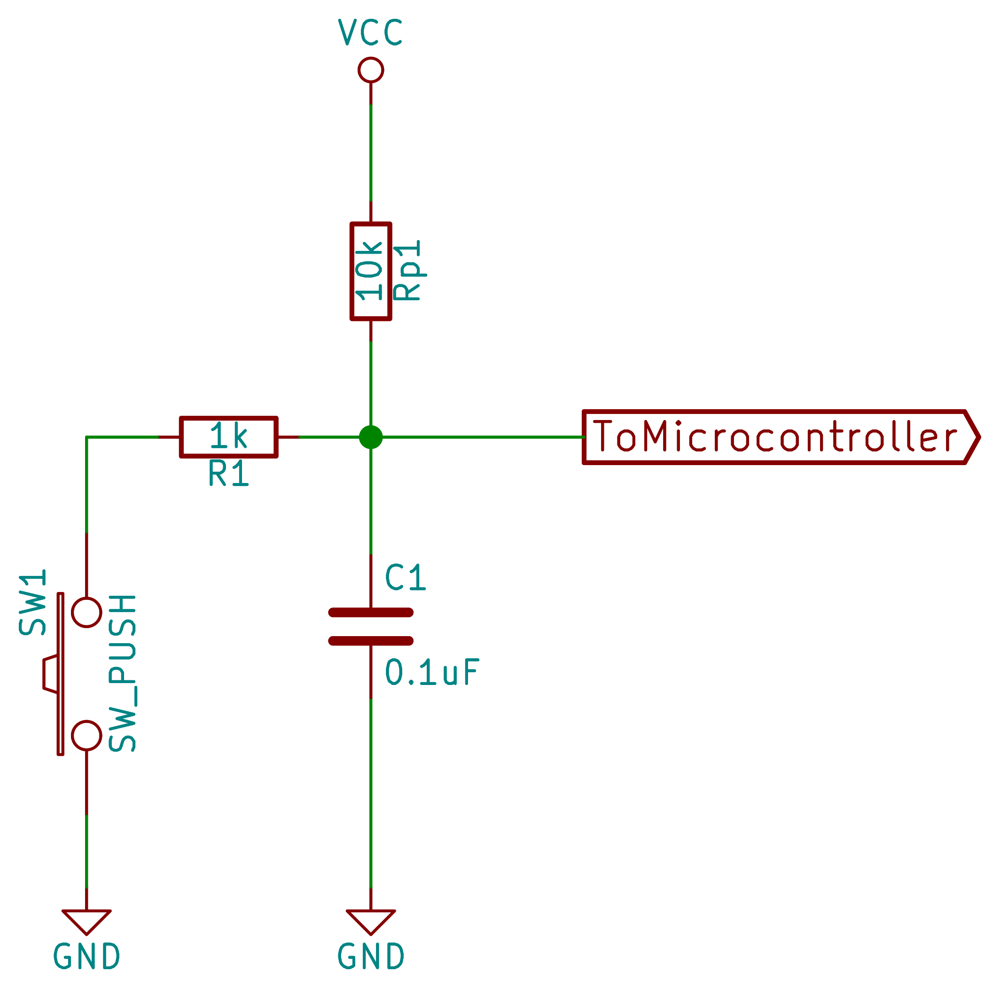

# Embedded_Digital_IO

<!-- ABOUT THE PROJECT -->
## About The Project

This project utilises a rotary encode to change the number on a seven segment display. Uses software debouncing but if two small capictors are avaible could also implement physical debouncing via the circuit below (low pass filter).

